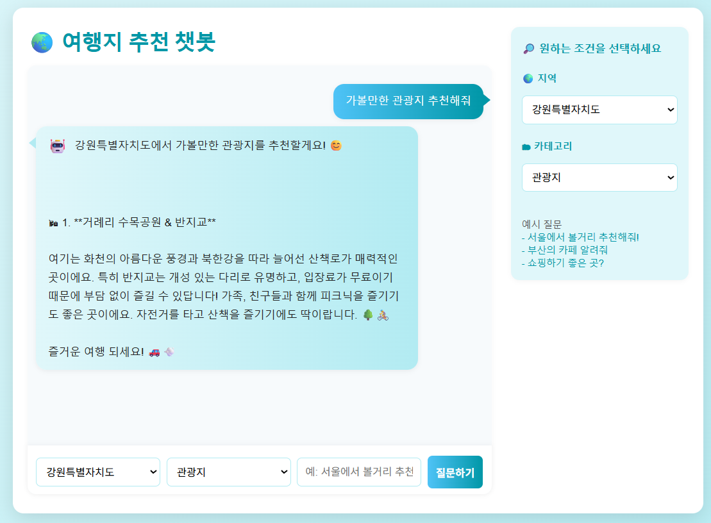

# SKN10-4rd-4Team

# LLM Document Q&A System


## 1. 주제 소개

이 프로젝트는 최신 LLM 기술과 RAG(Retrieval-Augmented Generation) 아키텍처를 활용하여,  
**사용자가 HTML에서 지역과 카테고리를 선택하고 자연어로 질문하면,내부 정제 문서 + 외부 TripAdvisor 리뷰 기반으로 장소를 추천해주는 챗봇 시스템**입니다.

---

## 2. 팀 소개

- **팀명:** 4조 (SKN10-4rd-4Team)
<table>
  <tr>
    <th>신정우</th>
    <th>이태수</th>
    <th>조현정</th>
    <th>남궁승원</th>
    <th>이유호</th>
  </tr>
  <tr>
    <td align="center"></td>
    <td align="center"></td>
    <td align="center"></td>
    <td align="center"></td>
    <td align="center"></td>
  </tr>
  <tr>
    <td align="center"><b>팀장</b></td>
    <td align="center" colspan="4"><b>팀원</b></td>
  </tr>
  <tr>
    <td align="center"><b>프로젝트 총괄</b><br>RAG & html구현<br>장소 csv데이터 수집 & 전처리<br>내부 RAG & TripAdvisor API 연동, 성능 테스트</td>
    <td align="center"><br>TourAPI 연동<br>데이터 수집 & 전처리<br>Data Embedding for VectorDB</td>
    <td align="center"><br>Html UI 구현 및 개발<br>TripAdvisor Api 생성 및 리뷰데이터 수집<br>내부 RAG & TripAdvisor API 연동, 성능 테스트</td>
    <td align="center"><br>엔터테인먼트 기사 크롤링후 csv 생성 & 전처리<br>RAG & Tavily 성능 테스트</td>
    <td align="center"><br>드라마,영화 순위 및 세부정보 크롤링후 csv 생성 & 전처리<br>RAG & Tavily 성능 테스트</td>
  </tr>
</table>

---

---

## ⚙️ 설치 및 실행 가이드

1. **프로젝트 세팅**
   ```bash
   git clone <레포주소>
   cd <프로젝트폴더>
   python -m venv .venv
   source .venv/bin/activate
   pip install -r requirements.txt
   ```

2. **환경 변수 구성**
   - `.env` 파일 생성 (OPENAI_API_KEY, TRIPADVISOR_API_KEY 등)
---
3. **ChromaDB 준비**
   - 루트에 `chroma_db` 폴더 필요

4. **서버 실행**
   ```bash
   python manage.py runserver
   ```

---

## 🎤 시연 시나리오 ①  
자연어 질문 → 여행지 추천

- 사용자가 입력:  
  `"서울에서 볼거리 추천해줘!"`
- 지역 / 카테고리 필터 설정 
` 서울 / 문화시설 `
- 챗봇이 질문을 이해하고  
  관련 여행지 + 요약 정보 제공

---

## 🎤 시연 시나리오 ②  
TripAdvisor 리뷰 요약 강조

- 각 여행지마다 TripAdvisor 리뷰 3건 수집
- LLM으로 실제 경험 기반 요약
- 단순 정보 제공과 차별화된 신뢰성

---



---

## 3. 수집된 데이터 및 데이터 전처리

### 3.1 수집 데이터

- 문화시설 장소 데이터: 서울시 및 경기권의 주요 문화공간, 전시시설 등 27000여 개

- 추가 활용 데이터: TripAdvisor API를 활용한 장소별 리뷰 및 평점 데이터

### 3.2 데이터 전처리 흐름

- .xlsx 기반 수집 → 필요 컬럼 정제 → 텍스트 클렌징 (특수문자, 개행 제거)

- 주소에서 앞 단어 추출 → 지역 컬럼 생성 (서울특별시, 경기도 등)

- 개요 + 상세정보 통합 → 내용 필드 생성 → SentenceTransformer로 임베딩

- ChromaDB 저장 시 메타데이터로 지역, 카테고리, 운영시간 등 포함
---

## 4. 시스템 아키텍처

**내부 문서 (CSV 포맷)**

- 프론트엔드: index.html - 지역, 카테고리, 자연어 질문 입력 UI

- 벡터DB: ChromaDB (로컬 디스크 기반 벡터 저장소)

- 임베딩 모델: intfloat/e5-large-v2 기반 텍스트 임베딩

- 백엔드: Django 기반 views.py

  - 내부 문서에서 조건(지역+카테고리)에 맞는 장소 추출

  - TripAdvisor API로 해당 장소 리뷰 받아오기

  - 설명 + 리뷰 통합 요약 → GPT-3.5-Turbo에게 전달하여 응답 생성

---

## 5. 핵심 기술

- **Django + OpenAI API + TripAdvisor API + ChromaDB**
- CSV 문서 불러오기 및 embedding 처리

- ChromaDB 벡터 DB를 통한 유사도 기반 문서 검색

- HTML 프론트엔드 UI에서 지역/카테고리 입력

- TripAdvisor 리뷰 기반 요약 생성 + 설명 결합 출력


---

## 6. 프로세스 흐름도

1. **사용자 입력 (HTML)** : 지역 & 카테고리 & 자연어 질문

2. 내부 문서 필터링 → 조건에 맞는 장소 추출

3. 장소 설명 + TripAdvisor 리뷰 → GPT에 전달

4. 응답 결과를 HTML로 출력

---

## 7. 아키텍처

- **프론트엔드**: `index.html` → 지역/카테고리 선택 + 질의 입력 UI
- **백엔드**: `views.py` → Django 기반 GPT 응답 로직 처리
- **벡터 저장소**: ChromaDB (로컬 폴더 기반)
- **문서 처리**: `xlsx` → 전처리 → CSV 저장 → 임베딩 → ChromaDB 저장

---

## 8. 기대 효과

- **문서 기반 응답**: 문서 내 실제 내용을 바탕으로 정확한 질의응답 가능
- **간편한 UI**: 원하는 정보의 카테고리를 간편하게 선택가능
- **LLM 활용도 극대화**: 문서 기반 추론으로 정답률 및 신뢰도 향상
- **사용자 니즈 충족**: 실제 다른 사람들의 후기 데이터를 인용하여 사용자의 추천 결과 만족확률 상승
- **데이터셋 추가 용이**: 기존 vectorDB에 정해진 형식의 데이터를 API로 쉽게 수집 가능

---

## 9. 개발과정중 발생 문제 & 해결방법

- **신정우** : 
- **이태수** :  api를 활용해서 dataset을 불러오려고 했는데,
tourapi라는 홈페이지 데이터는 21개의 api를 사용해서 만든 데이터셋이라 동일한 서식으로 데이터를 정제하는 것이 어려웠습니다.
마지막에는 데이터를 일일히 받아왔습니다.
또한, 데이터 정제에 시간이 꽤 오래 걸려서 시간을 줄일 수 있는 방법을 강구하였고, 런팟을 이용하여 batch_size를 늘려 시간을 줄일 수 있었습니다.
- **조현정** : 장소 진위 검증 문제:
처음에는 Tavily를 활용해 장소 정보를 검증하려 했지만, 정확도에 한계가 있어 TripAdvisor로 도메인을 좁혀 API를 통해 최신 리뷰 3개를 가져오고, 기존 RAG 결과와 결합해 요약하는 방식으로 구현을 마무리했습니다.
UI 개선:
템플릿 구조와 색상, 글꼴을 지속적으로 개선하고, 불필요한 요소를 제거해 사용성과 심미성을 동시에 높였습니다.
Git 업스트림 이슈:
브랜치 이름 변경 후 원격 브랜치를 삭제했더니 기존 업스트림을 추적해서 경고가 발생했고, 변경사항이 반영되지 않았습니다. 새 브랜치로 업스트림을 재설정해 문제를 해결했습니다.
- **남궁승원** : 
- **이유호** : 

---

## 10. 프로젝트 후기

- **신정우** : 
- **이태수** : 팀장님이 너무 고생하셨고, 팀원들도 최선을 다해서 좋은 결과물이 나온 것 같습니다.
결과적으로 충분히 사용할 수 있는 챗봇이 만들어졌다고 생각합니다.
- **조현정** : 기술적인 해결은 ChatGPT를 활용해 수월하게 처리할 수 있었지만,
사용자 중심의 기획과 지속적인 개선 방향 설정이 더 어려웠습니다.
프로젝트를 통해 처음부터 완벽할 수 없고, 계속 다듬어가는 과정이 중요하다는 걸 배웠습니다.
- **남궁승원** : 
- **이유호** : 